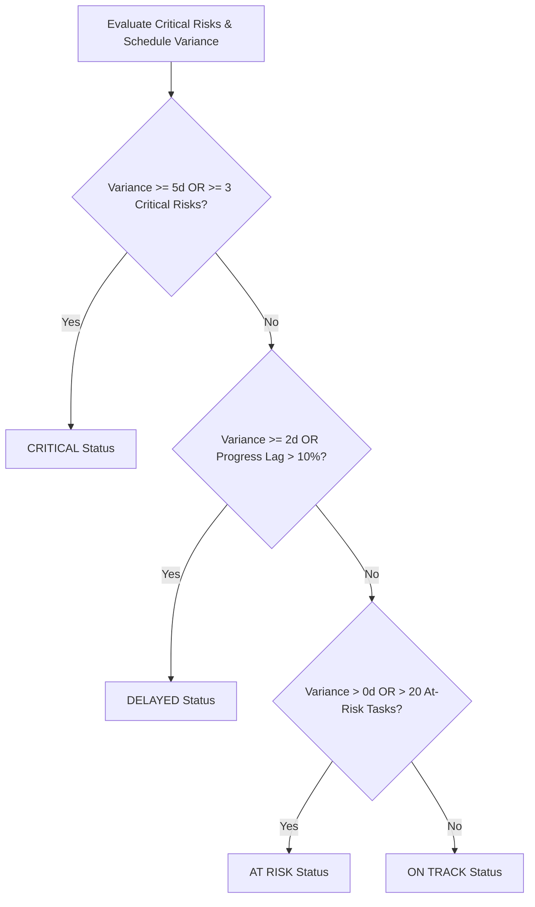

# SiteSync — Dashboard & Operational Metric Specification

## 1. Executive Summary

This document specifies the exact calculation methodologies, mathematical formulations, deterministic classification rules, and operational thresholds implemented in the **SiteSync Project Command Center** for **SIH 2026 problem statement SIH26122 (Oil India Limited)**.

To maintain engineering integrity, **zero business calculations are performed client-side**. All metrics are derived deterministically by backend query services (`DashboardSummaryService`, `ProgressAnalyticsService`, `DisciplineAnalyticsService`, `AttentionService`, `FreshnessService`).

---

## 2. Executive Metrics Definitions

### 2.1 Overall Project Progress (Duration-Weighted)

A naive arithmetic average of activity completion percentages misrepresents project state because small tasks (e.g. 2-day testing) would carry the same weight as major critical path packages (e.g. 60-day compressor foundation casting).

SiteSync implements a **Duration-Weighted Project Progress Methodology**:

$$\text{Project Progress} = \frac{\sum_{i=1}^{N} (\text{ActualProgress}_i \times \text{PlannedDuration}_i)}{\sum_{i=1}^{N} \text{PlannedDuration}_i} \times 100\%$$

Where:
- $\text{ActualProgress}_i \in [0.0, 1.0]$ is the verified progress fraction for activity $i$.
- $\text{PlannedDuration}_i = \max(1, \text{PlannedFinish}_i - \text{PlannedStart}_i)$ in workdays.
- $N$ is the total number of L5/L6 activities in the ingested project schedule.

```typescript
// Implementation in DashboardSummaryService
let totalPlannedDuration = 0;
let weightedActualProgressSum = 0;

for (const act of activities) {
  const duration = Math.max(1, act.plannedDuration || 1);
  const actProgress = act.actualProgress > 1 ? act.actualProgress / 100 : act.actualProgress;
  totalPlannedDuration += duration;
  weightedActualProgressSum += actProgress * duration;
}

const overallProgress = totalPlannedDuration > 0
  ? Math.round((weightedActualProgressSum / totalPlannedDuration) * 1000) / 10
  : 0;
```

---

### 2.2 Schedule Variance

Schedule variance measures the elapsed time slippage of actual execution relative to baseline targets:

1. **Start Variance (days)**:
   $$\Delta_{\text{start}} = \text{ActualStart} - \text{PlannedStart}$$

2. **Finish Variance (days)**:
   $$\Delta_{\text{finish}} = \text{ActualFinish} - \text{PlannedFinish}$$

3. **Duration Variance (days)**:
   $$\Delta_{\text{duration}} = \text{ActualDuration} - \text{PlannedDuration}$$

4. **Progress Delta**:
   $$\Delta_{\text{progress}} = \text{ActualProgress} - \text{PlannedProgress}$$

At the project executive level, **Schedule Variance** is calculated across the **Critical Path**:
$$\text{Project Schedule Variance} = \frac{1}{|C|} \sum_{i \in C} \text{VarianceDays}_i$$
Where $C$ represents all activities on the critical path ($\text{TotalFloat} = 0$).

---

### 2.3 Deterministic Project Status Rules

Project status is evaluated using deterministic threshold rules rather than unverified LLM inferences:



| Project Status | Trigger Condition | Status Description |
| :--- | :--- | :--- |
| **CRITICAL** | Critical path variance $\ge +5$ days OR $\ge 3$ critical risks on critical path | Severe schedule overrun endangering overall project completion milestone. |
| **DELAYED** | Variance $\ge +2$ days OR overall progress lag $> 10\%$ | Moderate delay requiring immediate crew acceleration or resource reallocation. |
| **AT RISK** | Variance $> 0$ days OR $> 20$ activities approaching zero float | Activity execution is consuming available schedule buffer. |
| **ON TRACK** | Variance $\le 0$ days AND zero critical delay signals | Execution is within planned milestone parameters. |

---

### 2.4 Schedule Activity Health Classification

Activities are classified into one of 5 mutual states:

```text
COMPLETED   : actualProgress >= 0.999 OR status == 'COMPLETED'
NOT_STARTED : actualProgress == 0.0 AND (actualStart == null OR status == 'NOT_STARTED')
DELAYED     : varianceDays > 2 OR (plannedProgress - actualProgress) > 0.20 OR status == 'DELAYED'
AT_RISK     : varianceDays > 0 OR (plannedProgress - actualProgress) > 0.08 OR isCritical == true
ON_TRACK    : Execution within planned tolerance window
```

---

## 3. Operational Data Freshness & Stale Detection

### 3.1 Centralized Stale Threshold
```typescript
export const DASHBOARD_CONFIG = {
  STALE_AFTER_HOURS: 48, // 48 hours without verified field update
  SCHEDULE_DELAY_DAYS_THRESHOLD: 2,
  PROGRESS_LAG_THRESHOLD: 0.15,
  LOW_CONFIDENCE_THRESHOLD: 0.70,
};
```

### 3.2 Stale Activity Definition
An activity is flagged with `STALE UPDATE` if:
$$\text{Status} = \mathbf{IN\_PROGRESS} \quad \text{AND} \quad (\text{CurrentTime} - \text{LastVerifiedUpdate}) > 48\text{ hours}$$

> **Important Operational Distinction**:
> `STALE UPDATE` denotes **absence of recent field visibility**, NOT that physical work has stopped. It alerts project planners to request site supervisor confirmation.

### 3.3 Data Freshness Percentage
$$\text{Data Freshness} = \frac{|\{a \in \text{Activities} \mid (\text{Now} - a.\text{lastUpdateDate}) \le 48\text{h}\}|}{|\text{Activities}|} \times 100\%$$

---

## 4. Discipline Performance Aggregation

Discipline performance is calculated by aggregating duration-weighted progress across discipline work packages:

$$\text{Discipline Actual Progress} = \frac{\sum_{i \in D} (\text{ActualProgress}_i \times \text{PlannedDuration}_i)}{\sum_{i \in D} \text{PlannedDuration}_i} \times 100\%$$

$$\text{Discipline Planned Progress} = \frac{\sum_{i \in D} (\text{PlannedProgress}_i \times \text{PlannedDuration}_i)}{\sum_{i \in D} \text{PlannedDuration}_i} \times 100\%$$

$$\text{Discipline Variance} = \text{Discipline Actual Progress} - \text{Discipline Planned Progress}$$

Supported Disciplines:
1. **Civil** (Foundations, Excavation, RCC, Pavements)
2. **Piping** (Fabrication, Welding, NDT, Hydrotesting, Erection)
3. **Mechanical** (Compressor Train, Scrubber Skids, Cooler Units)
4. **Electrical** (Substation Yard, Switchgear, Cable Trenches, Transformers)
5. **Instrumentation** (SCADA, DCS, Transmitters, Control Loops)
6. **HSE** (Firefighting Network, Gas Detection, Safety Compliance)
