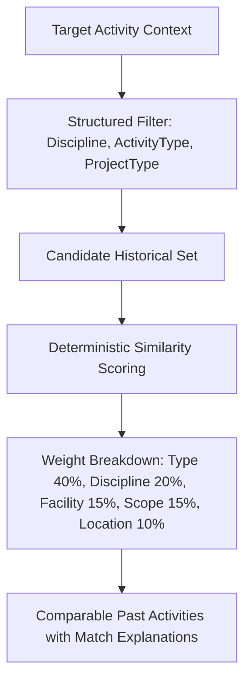

# SiteSync — Historical Intelligence & Institutional Memory Specification

**Product:** SiteSync — Planning → Reality Intelligence (SIH26122)  
**Organization:** Oil India Limited  
**Module:** Historical Intelligence & Institutional Memory Engine  
**Version:** 1.0  
**Status:** Implementation Baseline  

---

## 1. Executive Overview

Traditional project systems answer only:
> *"What is happening right now?"*

**SiteSync Historical Intelligence** additionally answers:
1. *"What happened on similar work before across Oil India capital assets?"*
2. *"How long did this type of work actually take (Median, P25, P75)?"*
3. *"What recurring execution bottlenecks, material shortages, or weather constraints caused delay?"*
4. *"What was the verifiable daily production velocity (m³/day, joints/day, m/day)?"*

---

## 2. Institutional Memory Principles

### 2.1 The Verification Gate
Unverified AI inferences or active, unclosed activities are **never** promoted directly into historical knowledge.
A task becomes an authoritative `HistoricalOutcome` if and only if:
```text
Activity Status == 'COMPLETED' (or 100% verified progress)
AND
Verified Actual Start Date is recorded
AND
Verified Actual End Date is recorded
```

### 2.2 Empirical Reality vs. Probabilistic Forecasts
Historical intelligence provides **evidence, not certainty**.
- The system presents: *"Comparable historical activities had a median verified duration of 7 days, with the middle 50% ranging from 6–10 days."*
- The system **never** claims: *"This activity WILL take 7 days."*

---

## 3. Statistical Distribution & Sample Quality Heuristics

### 3.1 Aggregation Metrics
Duration and variance statistics avoid deceptive single averages and compute:
- **Median**: 50th percentile (central empirical tendency)
- **P25**: 25th percentile (optimistic boundary)
- **P75**: 75th percentile (pessimistic / risk buffer boundary)
- **Mean**: Arithmetic average
- **Min / Max**: Range extremes
- **Sample Count ($N$)**: Total verified historical records

### 3.2 Sample Quality Classification
- **$\ge 20$ samples**: `STRONGER_HISTORICAL_BASE` — High statistical baseline across multiple completed capital assets.
- **$5 - 19$ samples**: `LIMITED` — Moderate confidence; indicative benchmark.
- **$< 5$ samples**: `LOW_SAMPLE` — Small sample warning; explicit UI banner to treat estimate cautiously.
- **$0$ samples**: `INSUFFICIENT_HISTORY` — Insufficient data to compute distributions.

---

## 4. Controlled Delay Taxonomy

Delay causes are categorized into a controlled 14-category taxonomy backed by cited field report evidence:

| Delay Cause | Display Label | Description |
| :--- | :--- | :--- |
| `MATERIAL` | Material & Equipment Procurement Delays | Vendor supply chain delays, damaged deliveries, non-conformance. |
| `LABOR` | Labor Availability & Skill Shortage | Shortage of certified welders, riggers, or trade crew. |
| `DESIGN` | Engineering & Design Revisions | Isometric drawing revisions, clash resolution, IFC delays. |
| `EQUIPMENT` | Site Equipment Breakdown | Crane breakdown, excavator hydraulic seal failure, rig downtime. |
| `WEATHER` | Monsoon & Adverse Weather Conditions | Heavy monsoon rainfall, waterlogging, high wind speed. |
| `CONTRACTOR` | Contractor Mobilization & Management | Subcontractor dispute, rigger shortage, welder absenteeism. |
| `APPROVAL` | Regulatory & Inspection Sign-offs | Hydrotest clearance, safety permit-to-work hold, NDT sign-off. |
| `SITE_ACCESS` | Right of Way (RoW) & Site Handover | Land clearance delay, physical obstruction, security hold. |
| `SAFETY` | HSE Incident & Stand-down | Near-miss investigation, gas alarm drill, mandatory safety stand-down. |
| `QUALITY_REWORK` | Quality Non-Conformance & Rework | Radiography (RT) failure, concrete honeycombing repair. |
| `LOGISTICS` | Transport & Logistics Clearance | Heavy-lift road transit delays, terminal congestion. |
| `PLANNING` | Interface Sequencing & Float | Predecessor clash, workfront unavailability. |
| `OTHER` | Documented Other Site Factors | Documented site-specific constraints. |
| `UNKNOWN` | Undocumented Delay Cause | Variance occurred without verified causal explanation in DPR. |

---

## 5. Structured-First Similarity Architecture

To prevent nonsensical comparisons (e.g. comparing cable testing with foundation excavation based on lexical token overlap), SiteSync uses a **Structured-First Candidate Filter**:



### 5.1 Similarity Scoring Components
1. **Activity Type Match (40%)**: Exact match = $0.40$, partial/related match = $0.28$, naming overlap = $0.20$.
2. **Discipline Match (20%)**: Identical discipline = $0.20$.
3. **Project Type Match (15%)**: Oil India capital facility classification = $0.15$.
4. **Quantity Scale Compatibility (15%)**: Volume ratio $\ge 60\%$ = $0.15$.
5. **Location Proximity (10%)**: Site terminal match = $0.10$, regional basin proximity = $0.06$.

---

## 6. Verifiable Productivity Model

Productivity is calculated strictly when volumetric or linear units and verified durations exist:
$$\text{Productivity} = \frac{\text{Actual Quantity}}{\text{Verified Actual Duration}}$$

### Standardized Units:
- **Civil Earthwork / Excavation**: $\text{m}^3/\text{day}$
- **RCC Concreting / Subbase**: $\text{m}^3/\text{day}$
- **Structural Steel Erection**: $\text{MT}/\text{day}$
- **Piping Fabrication & Spools**: $\text{joints}/\text{day}$
- **Cable Laying**: $\text{m}/\text{day}$
- **Transmitter / Loop Checking**: $\text{loops}/\text{day}$

---

## 7. Data Lineage & Auditability

Every historical number is traceable back to ground truth evidence:
```text
HistoricalOutcome
  └── Activity
        └── Verified ProgressUpdate
              └── ReviewDecision (Planner Sign-off)
                    └── FieldReport Citation (PDF Name + Page Number + Quoted Text)
```

---

## 8. Project Closure & Quality Gate

Project transitions through controlled lifecycle states:
$$\text{ACTIVE} \longrightarrow \text{CLOSING} \longrightarrow \text{COMPLETED} \longrightarrow \text{ARCHIVED}$$

During closure, a **Historical Data Quality Report** audits:
- Total Completed Activities
- Eligible for History
- Missing Actual Start Dates
- Missing Actual End Dates
- Missing Quantities
- Undocumented Delays (`UNKNOWN`)
- Low-Quality / Unreviewed Records
