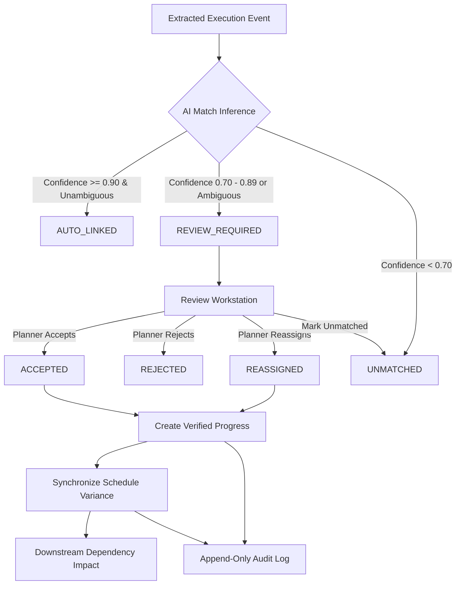

# SiteSync — Review Workflow & Schedule Synchronization Architecture

## 1. Core Principle

```text
AI PROPOSES
    ↓
SYSTEM EXPLAINS (7 Component Signals + Confidence + Margin)
    ↓
HUMAN VERIFIES (Planner / Project Manager Sign-off)
    ↓
SYSTEM RECORDS EVIDENCE (PDF Page / Excel Cell / Timestamp)
    ↓
VERIFIED PROGRESS IS CREATED (Monotonic Domain Rules)
    ↓
SCHEDULE STATE IS SYNCHRONIZED (Start, End, Duration, Progress Variances)
    ↓
DEPENDENCY IMPACT RECALCULATED (Downstream Successor Graph)
    ↓
EVERY MUTATION IS AUDITED (Immutable Append-Only Audit Trail)
```

> [!IMPORTANT]
> **No LLM or AI matching service directly modifies authoritative project execution data.**
> The AI service produces *inference proposals*; the application domain layer enforces validation, verification, and auditability.

---

## 2. Review State Machine



### Supported Match States
| State | Description | Authoritative Action |
|---|---|---|
| `MATCHED` / `AUTO_LINKED` | High-confidence, unambiguous AI match proposal ($\ge 0.90$) | Awaiting or auto-routed to verified progress |
| `REVIEW_REQUIRED` | Medium-confidence ($0.70-0.89$), close candidate margin ($\Delta < 0.05$), or granularity mismatch | Enters Review Queue for human sign-off |
| `ACCEPTED` | Planner verified and approved AI proposed activity | Creates verified `ProgressUpdate` and syncs schedule |
| `REJECTED` | Planner rejected AI candidate with mandatory justification | Preserves AI proposal in history, records audit |
| `REASSIGNED` | Planner reassigned event to human-selected alternative activity | Creates verified `ProgressUpdate` for reassigned activity |
| `UNMATCHED` | Out-of-scope event with no corresponding planned activity | Logged as unmatched, does not alter schedule |
| `SUPERSEDED` | Historical proposal replaced by a newer matcher algorithm version | Preserved for benchmark audit |

---

## 3. Review Decision Priority Engine

The review queue ranks pending items using a deterministic **Review Priority Score ($0-100$)**:

$$\text{Review Priority} = \text{Uncertainty} + \text{Ambiguity} + \text{Schedule Criticality} + \text{Downstream Impact} + \text{Recency}$$

### Priority Component Breakdown
1. **Uncertainty Component ($0-35$ pts)**: $(1.0 - \text{Confidence}) \times 35$
2. **Ambiguity Component ($0-25$ pts)**:
   - Margin $\Delta < 0.03 \rightarrow +25$ pts (high ambiguity)
   - Margin $\Delta < 0.06 \rightarrow +18$ pts (low margin)
   - Granularity mismatch detected $\rightarrow +10$ pts
3. **Schedule Criticality Component ($0-20$ pts)**: If candidate activity is on the **Critical Path** ($0$ float) $\rightarrow +20$ pts
4. **Downstream Dependency Impact ($0-15$ pts)**:
   - Successor count $\ge 4 \rightarrow +15$ pts
   - Successor count $1-3 \rightarrow \text{Count} \times 3$ pts
5. **Recency Component ($0-5$ pts)**: Current report cycle $\rightarrow +5$ pts

---

## 4. Evidence Chain & Backward Traceability

Every verified progress update maintains an unbroken backward evidence chain:

```text
ProgressUpdate (id: prog-civ-042-...)
      ↓
ReviewDecision (id: dec-acc-..., decision: ACCEPT, reviewer: Lead Planner)
      ↓
ActivityMatch (id: match-case-001, confidence: 96%, rank: #1)
      ↓
ExtractedEvent (id: evt-case-001, progress: 95%, discipline: CIVIL)
      ↓
FieldReport (id: DPR-2026-03-12, format: PDF, SHA256 verified)
      ↓
Primary Source Locator (DPR-2026-03-12.pdf — Page 3, quoted text)
```

---

## 5. Verified Progress & Monotonic Progression Rules

- **Numerical Bounds**: $0.0 \le \text{Progress} \le 1.0$.
- **Monotonic Progression**: Normal progress updates cannot decrease ($\text{NewProgress} \ge \text{PreviousProgress}$).
- **Completion Rules**:
  - $\text{Progress} = 1.0 \rightarrow \text{Status} = \mathbf{COMPLETED}$ and $\text{actualEndDate} = \text{EffectiveDate}$.
- **Start Rules**:
  - $\text{Progress} > 0.0 \rightarrow \text{Status} = \mathbf{IN\_PROGRESS}$ and $\text{actualStartDate} = \text{EffectiveDate}$ (if null).
- **Authorized Correction Workflow**: If a planner must correct bad data (e.g. $85\% \rightarrow 80\%$), they must submit a formal correction with a mandatory explanation reason and authorized role (`PLANNER`, `PROJECT_MANAGER`, `ADMIN`), generating a `PROGRESS_CORRECTED` audit event.

---

## 6. Schedule Variance & Dependency Impact Engine

### Deterministic Variance Formulas
- **Start Variance (days)**:
  $$\text{Start Variance} = \text{Actual Start} - \text{Planned Start}$$
- **End Variance (days)**:
  $$\text{End Variance} = \text{Actual End} - \text{Planned End}$$
- **Duration Variance (days)**:
  $$\text{Duration Variance} = \text{Actual Duration} - \text{Planned Duration}$$
- **Progress Variance**:
  $$\text{Progress Variance} = \text{Actual Progress} - \text{Planned Progress}$$

### Downstream Dependency Traversal
When an activity's variance is updated, the system traverses the project dependency graph to evaluate all downstream successor activities:
$$\text{Potential Start Delay} = \max(0, \text{Predecessor Variance Days} - \text{Dependency Lag})$$

Successors on the Critical Path are tagged with priority escalation alerts.

---

## 7. Role-Based Access Control (RBAC) & Project Isolation

| Role | Submit Field Reports | View Matches | Approve / Reject / Reassign | Progress Corrections |
|---|:---:|:---:|:---:|:---:|
| **ADMIN** | ✓ | ✓ | ✓ | ✓ |
| **PROJECT_MANAGER** | ✓ | ✓ | ✓ | ✓ |
| **PLANNER** | ✓ | ✓ | ✓ | ✓ |
| **SUPERVISOR** | ✓ | ✓ | ✗ | ✗ |
| **VIEWER** | ✗ | ✓ | ✗ | ✗ |

- **Project Isolation Guard**: Every review request validates that the target entity's `projectId` matches the caller's authorized workspace project. Cross-project requests are rejected with `403 Forbidden`.

---

## 8. Idempotency & Duplicate Protection

1. **Request Idempotency**: Review action submissions accept an idempotency key (`x-request-id` header or `requestId` field). Repeated requests return the cached result without duplicating `ReviewDecision`, `ProgressUpdate`, or `AuditLog` records.
2. **Duplicate Report Ingestion Guard**: Field reports compute SHA256 checksums on ingestion. Re-uploading an identical report does not produce duplicate extracted events or progress updates.

---

## 9. Immutable Audit Trail

Audit records are strictly append-only:
```json
{
  "id": "audit-1789562840-a1b2c",
  "projectId": "PROJ-OIL-2026-01",
  "actorId": "usr-planner-01",
  "actorName": "Lead Planner",
  "actorType": "USER",
  "action": "MATCH_ACCEPTED",
  "entityType": "ActivityMatch",
  "entityId": "match-case-001",
  "beforeState": { "status": "REVIEW_REQUIRED" },
  "afterState": { "status": "ACCEPTED", "activityId": "CIV-EXC-0042" },
  "explanation": "Planner Lead Planner accepted AI match proposal for CIV-EXC-0042 (Excavation for Compressor Foundation C-101).",
  "timestamp": "2026-03-12T10:00:00.000Z"
}
```
