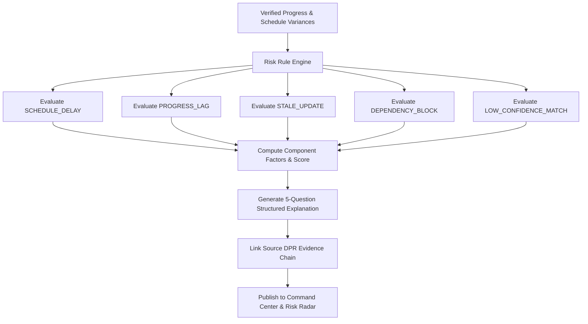

# SiteSync — Deterministic Risk Engine Specification

## 1. Overview

The SiteSync **Risk Engine** transforms verified execution data into proactive project risk signals.

> **Core Principle**: Project risks must be **deterministic, explainable, and evidence-backed**. SiteSync does not use opaque ML black-box scoring or hallucinatory LLM risk claims. Every risk is derived from deterministic rules and links directly to verifiable source evidence.

---

## 2. Risk Taxonomy

SiteSync supports 6 deterministic risk categories:

| Risk Type | Trigger Condition | Default Severity | Primary Factors |
| :--- | :--- | :--- | :--- |
| **`SCHEDULE_DELAY`** | Activity start or finish delayed $> 2$ days relative to baseline schedule | `MEDIUM` / `HIGH` / `CRITICAL` | Days of delay, Critical Path status, Downstream successor count |
| **`PROGRESS_LAG`** | Actual progress is $> 15\%$ behind planned progress velocity | `MEDIUM` / `HIGH` | Progress delta %, Planned duration overrun projection |
| **`STALE_UPDATE`** | In-progress activity has received no verified DPR updates for $> 48$ hours | `LOW` / `MEDIUM` | Elapsed hours since last verified field update, Activity status |
| **`DEPENDENCY_BLOCK`** | Predecessor activity has delayed $> 2$ days, blocking start of downstream task | `HIGH` / `CRITICAL` | Predecessor delay days, Predecessor status, Zero float status |
| **`LOW_CONFIDENCE_MATCH`** | Critical path activity proposal has match confidence $< 70\%$ in review queue | `MEDIUM` | Confidence deficit, Critical path flag, Candidate ambiguity |
| **`MISSING_UPDATE`** | Expected start date passed with zero reported field updates | `MEDIUM` | Elapsed days since planned start, Milestone impact |

---

## 3. Explainable Risk Scoring Model

Each detected risk receives an explainable score between $0$ and $100$ calculated from transparent weighted component factors:

```json
{
  "score": 78,
  "severity": "HIGH",
  "factors": [
    {
      "type": "SCHEDULE_DELAY",
      "label": "Schedule Variance",
      "value": "+4 days",
      "weight": 0.4,
      "impactScore": 32
    },
    {
      "type": "DOWNSTREAM_DEPENDENCIES",
      "label": "Downstream Successors",
      "value": 4,
      "weight": 0.3,
      "impactScore": 24
    },
    {
      "type": "CRITICAL_ACTIVITY",
      "label": "Critical Path Status",
      "value": true,
      "weight": 0.3,
      "impactScore": 30
    }
  ]
}
```

$$\text{Risk Score} = \min\left(100, \sum_{i} \text{FactorImpactScore}_i\right)$$

### Severity Scale:
- **`CRITICAL`** ($\text{Score} \ge 80$ OR Delay $\ge 5\text{d}$ on Critical Path)
- **`HIGH`** ($60 \le \text{Score} < 80$ OR Delay $\ge 3\text{d}$)
- **`MEDIUM`** ($40 \le \text{Score} < 60$)
- **`LOW`** ($\text{Score} < 40$)

---

## 4. 5-Question Explainability Standard

Every risk record presented to project managers must answer five structured questions:

```text
1. What happened?
   Activity execution is delayed by 4 days relative to planned baseline.

2. Why does it matter?
   This activity lies on the Critical Path; delay directly impacts the overall project completion milestone.

3. What evidence supports it?
   Verified schedule variance of +4 days (Planned: 10/09/2026, Actual: 14/09/2026).
   Source: DPR-2026-09-16.pdf — Page 4.

4. What is affected?
   4 downstream successor activities (PCC Pouring, Reinforcement Binding, Formwork, Concrete Pouring).

5. What should a human inspect?
   Expedite foundation concrete crew or review downstream predecessor schedule float.
```

---

## 5. Architectural Flow


