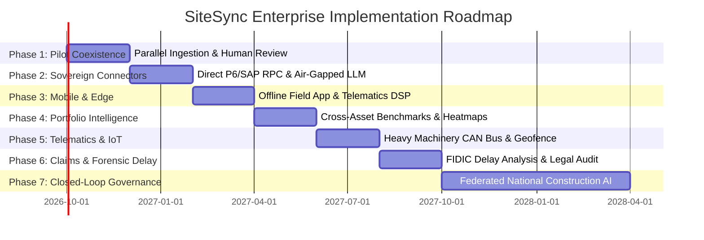

# SiteSync — Enterprise Evolution Roadmap

**Product:** SiteSync — Planning → Reality Intelligence  
**Target Enterprise:** Oil India Limited & Mega-Infrastructure Operators  
**Timeline:** 18-Month Phased Rollout Plan  

---

## 1. Roadmap Architecture

The evolution of SiteSync from the evaluated v1.0.0 prototype to an enterprise-wide sovereign deployment across national energy assets follows a strict 7-phase operational maturation model.

---

## 2. Phase-by-Phase Execution Plan

### Phase 1: Pilot Coexistence & Shadow Operation (Months 1–2)
* **Objective:** Zero-risk integration operating alongside existing Oil India planning workflows.
* **Architecture:**
  * Daily scheduled ingestion of Primavera P6 `.xer` and Microsoft Project `.xml` files.
  * Human-in-the-loop: 100% of AI proposed matches presented in Review Queue workstation.
  * Zero automated schedule mutations without chief planner electronic sign-off.
* **Deliverable:** Weekly reconciliation accuracy audit comparing manual planner reports against SiteSync automated linking.

### Phase 2: Direct Sovereign Connectors & Air-Gapped LLM (Months 3–4)
* **Objective:** Sovereign, on-premise execution compliant with Indian critical energy infrastructure cybersecurity directives (CERT-In / MoPNG guidelines).
* **Architecture:**
  * Oracle Primavera P6 EPPM Web Services connector daemon.
  * SAP PS (Project System) RFC/BAPI bidirectional connector for materials and billing reconciliation.
  * Local air-gapped LLM inference via vLLM / Ollama deploying fine-tuned Llama-3 70B & Whisper Large-v3 inside Oil India VPC.
* **Security:** All model weights and embeddings hosted on private GPU clusters; zero external network egress.

### Phase 3: Field Mobile App with Offline PWA & Edge DSP (Months 5–6)
* **Objective:** Eliminate paper-based site diaries and unverified WhatsApp status groups.
* **Architecture:**
  * Lightweight Progressive Web App (PWA) / React Native mobile client.
  * Local IndexedDB offline queueing with bidirectional CRDT (Conflict-free Replicated Data Types) synchronization upon network reconnect.
  * Hardware-accelerated RNNoise audio filtering to cancel ambient heavy machinery noise during voice log recording.
  * EXIF geofencing and cryptographic timestamping of photo evidence.

### Phase 4: Multi-Project Portfolio Intelligence (Months 7–8)
* **Objective:** Aggregate multi-site contractor velocity and supply chain bottlenecks across regional fields (Assam, Rajasthan, Offshore).
* **Architecture:**
  * Unified cross-project knowledge graph aggregating WBS performance across 50+ simultaneous projects.
  * Contractor velocity benchmarking: quantitative scorecards comparing vendor historical velocity against bid claims.
  * Portfolio-wide critical path heatmaps highlighting shared equipment and subcontractor resource contentions.

### Phase 5: Autonomous Telematics & IoT Equipment Linking (Months 9–10)
* **Objective:** Ground-truth physical verification independent of human reportage.
* **Architecture:**
  * Telematics integration with heavy equipment fleets (Caterpillar / Komatsu CAN bus / J1939 telematics).
  * Auto-verification of earthwork and excavation activities based on machine engine hours and GPS movement within WBS geofences.
  * RFID and BLE beacon tracking for piping spool arrival, hydrotesting, and erection sequencing.

### Phase 6: Automated Forensic Delay Analysis & Contract Claims Defense (Months 11–12)
* **Objective:** Eliminate prolonged contractual disputes and arbitration claims between owner and EPC contractors.
* **Architecture:**
  * Automated implementation of standard delay analysis methodologies (As-Planned vs. As-Built, Impacted As-Planned, Windows Analysis).
  * Immutable cryptographically chained audit log tracking every schedule revision, baseline delta, and weather delay event.
  * Automated delay causation attribution complying with FIDIC and CPWD contract specifications.

### Phase 7: Closed-Loop National Construction AI (Months 13–18)
* **Objective:** Enterprise-scale predictive project governance and national infrastructure productivity intelligence.
* **Architecture:**
  * Closed-loop corrective action generation: AI suggests optimal schedule compression strategies (crashing, fast-tracking) based on historical recovery success rates.
  * Federated learning architecture enabling cross-PSU intelligence sharing (e.g., Oil India, ONGC, GAIL, IOCL) without compromising proprietary commercial bid data.

---

## 3. Technology Stack Evolution

| Layer | Release v1.0.0 (Evaluated) | Enterprise Target (Phase 7) |
| :--- | :--- | :--- |
| **Frontend** | Next.js 14, TailwindCSS, Lucide, Recharts | Next.js Microfrontends + React Native Mobile |
| **Backend** | Fastify / Next.js Server Actions | Distributed Go / Rust Microservices + Kafka |
| **Database** | SQLite / PostgreSQL + Prisma | Distributed PostgreSQL (pgvector) + TimescaleDB |
| **Search / Vector** | In-Memory Cosine / pgvector | Multi-node Qdrant / Milvus Cluster |
| **AI Inference** | Local Deterministic Simulation / OpenAI API | On-Premise GPU Inference Cluster (Triton / vLLM) |
| **Scheduler Link** | File Import/Export (`.xer`, `.xml`) | Native Primavera P6 Web Services & SAP BAPI |

---

*SiteSync Enterprise Roadmap aligns directly with Ministry of Petroleum and Natural Gas (MoPNG) Digital Transformation mandates.*
